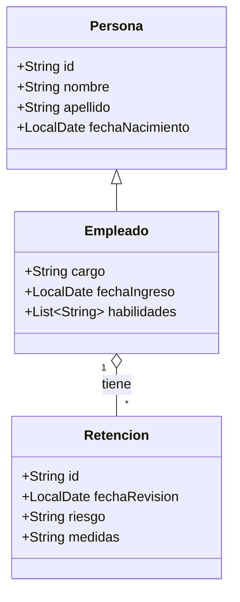

# Diagrama de clases (Mermaid)

```mermaid
classDiagram
    class Persona {
        +String id
        +String nombre
        +String apellido
        +LocalDate fechaNacimiento
    }
    class Empleado {
        +String cargo
        +LocalDate fechaIngreso
        +List~String~ habilidades
    }
    class Retencion {
        +String id
        +LocalDate fechaRevision
        +String riesgo
        +String medidas
    }
    Persona <|-- Empleado
    Empleado "1" o-- "*" Retencion : tiene
```

> Las flechas muestran herencia y asociación; se pueden extender según se analice el proceso.
